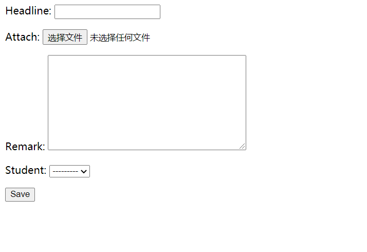
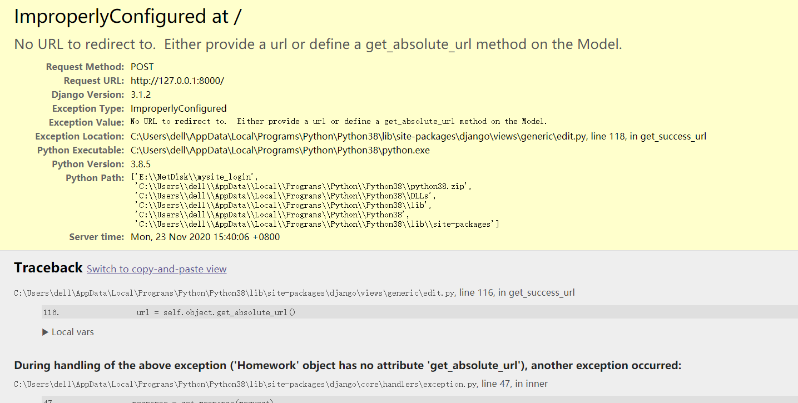
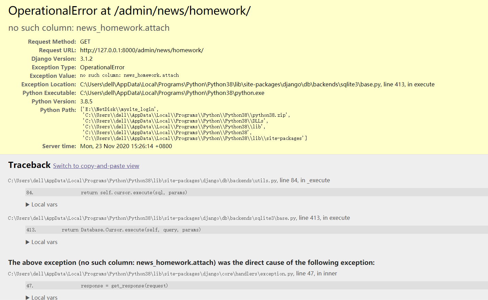

#<font face="方正大标宋简体">分布式技术作业</font>

>**19级大数据管理与应用 薛彬彬**
>**学号2019302190071**

##作业要求
**利用*Django*编写前端网页及后端数据库等实现具有秒传功能的云盘系统**


[TOC]

##作业完成过程

###一.在vode中创建Django的项目文件

####1.创建项目主体文件mysite_login

在所需要创建的位置通过命令符输入代码`django-admin startproject mysite_login`

在项目包中的`settings.py`更改时区为亚洲/上海，语言为中文
```python
LANGUAGE_CODE = 'zh-hans'

TIME_ZONE = 'Asia/Shanghai'

USE_I18N = True

USE_L10N = True

USE_TZ = False
```

在vscode终端中输入`py manage.py runserver`运行服务器进行调试

测试服务器运行正常

输入`py manage.py startapp login`创建登录应用命名为`login`

在项目包中的`settings.py`文件里添加`login`应用
```python
INSTALLED_APPS = [
    'django.contrib.admin',
    'django.contrib.auth',
    'django.contrib.contenttypes',
    'django.contrib.sessions',
    'django.contrib.messages',
    'django.contrib.staticfiles',
    'login',
]
```

在`login`应用文件夹中创建`urls.py`及`templates`文件夹

####2.配置数据库
>2020年11月9日 第十周课内容

建立一个新应用命名为`news`
在项目包中的`settings.py`文件里添加`news`应用
```python
INSTALLED_APPS = [
    'django.contrib.admin',
    'django.contrib.auth',
    'django.contrib.contenttypes',
    'django.contrib.sessions',
    'django.contrib.messages',
    'django.contrib.staticfiles',
    'login',
    'news',
]
```
配置models数据模型
```pyhton
from django.db import models

class Reporter(models.Model):
    full_name = models.CharField(max_length=70)

    def __str__(self):
        return self.full_name

class Article(models.Model):
    pub_date = models.DateField()
    headline = models.CharField(max_length=200)
    content = models.TextField()
    reporter = models.ForeignKey(Reporter, on_delete=models.CASCADE)

    def __str__(self):
        return self.headline
```

进行数据库迁移
```python
python manage.py makemigrations
python manage.py migrate
```

配置`news`中的`admin`页面
```python
from django.contrib import admin

from . import models

admin.site.register(models.Article)
```
创建超级用户，设置密码
```
python manage.py createsuperuser
```
在`news/admin.py`中创建`Repoter`模型

在`news`文档中新建`urls.py`配置根路由

```python
from django.urls import path

from . import views

urlpatterns = [
    path('articles/<int:year>/', views.year_archive),
    path('articles/<int:year>/<int:month>/', views.month_archive),
    path('articles/<int:year>/<int:month>/<int:pk>/', views.article_detail),
]
```
在`news/views.py`中配置view函数
```python
from django.shortcuts import render

from .models import Article

def year_archive(request, year):
    a_list = Article.objects.filter(pub_date__year=year)
    context = {'year': year, 'article_list': a_list}
    return render(request, 'news/year_archive.html', context)
```
创建文件`news/templates/news/year_archive.html`编写html页面样式
```html


Articles for {{ year }}


<h1>Articles for {{ year }}</h1>


    <p>{{ article.headline }}</p>
    <p>By {{ article.reporter.full_name }}</p>
    <p>Published {{ article.pub_date|date:"F j, Y" }}</p>


```
创建文件`news/templates/base.html`编写html页面样式
```html

<html>
<head>
    <title></title>
</head>
<body>
    
    
</body>
</html>
```
在`mysite_login/urlspy`中添加一行命令对`news`应用的地址进行配置
```python
    path('news/', include('news.urls')),
```
此时news应用网页可以正常访问
可以在`news/templates/news/year_archive.html`中添加div样式尝试改变标题颜色
```html
<h1><div style="color:red">Articles for {{ year }}</div></h1>
```

将相关修改内容及新建文件提交至`git`仓库

####3.建立HOMEWORK提交表单
>2020/11/23 第十二周上课内容

在`news/models.py`中更改之前的`Report`,`Article`为`Student`,`Homework`
```python
from django.db import models

class Student(models.Model):
    full_name = models.CharField(max_length=70)
    class Sex(models.IntegerChoices):
        MALE = 1, ('MALE')
        FEMALE = 2, ('FEMALE')
        OTHER = 3, ('OTHER')
    sex = models.IntegerField(choices=Sex.choices)
    def __str__(self):
        return self.full_name

class Homework(models.Model):
    commit_date = models.DateField(auto_now=True)
    headline = models.CharField(max_length=200)
    attach = models.FileField()
    remark = models.TextField()
    student = models.ForeignKey(Student, on_delete=models.CASCADE)
```
新建`news/templates/homework_form.html`表格提交html显示文件，并添加代码

```html
<html>
<body>
<form method="post">
    {{ form.as_p }}
    <input type="submit" value="Save">
</form>
</body>
</html>
```

更改`news/view.py`配置文件，添加表格形式
```python
from.models import Student, Homework

from django.views.generic.edit import CreateView


class HomeworkCreate(CreateView):
    model = Homework
    template_name = 'homework_form.html'
    fields = ['headline','attach','remark','student']
```

在`news/urls.py`中更改访问URL
```python
urlpatterns = [
    path('hw/create/', views.HomeworkCreate.as_view()),
```
在`news/admin.py`后台中添加`Student`用户组

```python
admin.site.register(models.Student)
```
**进行数据库迁移`python .\manage.py makemigrations`,`python .\manage.py migrate`**
修改`news/temples/homework_form.html`form表单bug
```html
<html>
<body>
<form method="post" enctype="multipart/form-data" >
    {{ form.as_p }}
    <input type="submit" value="Save">
</form>
</body>
</html>
```
在`news/urls.py`和`mysite_login/urls.py`中创建根路径
```python
    path('',include('news.urls')),
```
```python
    path('', views.HomeworkCreate.as_view()),
```
运行服务器


成功提交文件后，因为没有跳转网页因此提示



##主要问题和解决方法
1.在配置数据库时遇到问题，当使用pip安装sqlite后在vscode终端输入`sqlite3`想要访问数据库时提示
```python
PS E:\NetDisk\mysite_login> sqlite3
sqlite3 : 无法将“sqlite3”项识别为 cmdlet、函数、脚本文件或可运行程序的名称。请检查名称的拼写，如果包括路径，   
请确保路径正确，然后再试一次。
所在位置 行:1 字符: 1
+ sqlite3
+ ~~~~~~~
    + CategoryInfo          : ObjectNotFound: (sqlite3:String) [], CommandNotFoundException
    + FullyQualifiedErrorId : CommandNotFoundException
```
**解决方法：** 根据提示错误代码应为sqlite环境未加入系统环境，从sqlite下载安装包并配置进系统环境后访问sqlite成功
```cmd
C:\Users\dell>sqlite3
SQLite version 3.33.0 2020-08-14 13:23:32
Enter ".help" for usage hints.
Connected to a transient in-memory database.
Use ".open FILENAME" to reopen on a persistent database.
sqlite>
```
2.在git push时提示错误`Updates were rejected because the remote contains work that you do`
**解决方法：** 根据网上提示讲仓库初始化`git init`后问题解决

3.在创建文件上传表格页面时提交文件后提示错误`OperationalError at /admin/news/homework/`

**解决方法：** 强制令`models.py`中的`attach`可以为空

>**attach = models.FileField(null=True)**

后问题解决

##作业结果展示
NetDisk仓库地址`https://github.com/BineaHsueh/NetDisk`